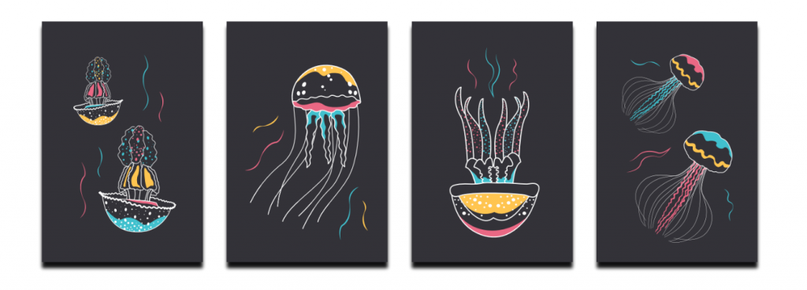

### Hi there 👋

<!--   -->

- 🔭 I’m currently floating.

:seedling: :potted_plant: :deciduous_tree: :palm_tree: :leaves: :four_leaf_clover: :broccoli: :sunflower: :mushroom: :herb: :cactus: :palm_tree: :tulip: :cherry_blossom: :rose: :hibiscus: :bouquet: :melon: :cucumber: :watermelon: :lemon: :tomato: :strawberry: :cherries: :orange: :coconut:  :avocado: :peanuts: :potato: :corn: :honeybee:	:butterfly: :spider: :lady_beetle: :bug: :maple_leaf:

  

